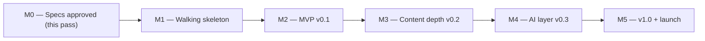

# Meguru — Business Requirements Document

> **Status:** Draft v0.1 · **Model:** Free OSS (no revenue goal) · **Team:** solo dev, nights/weekends
> Companion docs: [TECH_STACK.md](TECH_STACK.md) · [PRD.md](PRD.md) · [CONSTITUTION.md](CONSTITUTION.md)

## Project Goals & Success Metrics

Meguru is a hobby-plus-portfolio project. "Business value" here means personal learning outcomes and professional signaling — framed with the same rigor a commercial project would get, because that framing _is_ part of the portfolio value.

| #   | Goal                                                                            | "Done" looks like                                                                             | "Successful" looks like                                                                             |
| --- | ------------------------------------------------------------------------------- | --------------------------------------------------------------------------------------------- | --------------------------------------------------------------------------------------------------- |
| G1  | **Daily-use study tool for the author** (primary)                               | MVP v0.1 shipped; author completes first real review session on it                            | Author uses it for real study on ≥ 80% of days over a 90-day window; measurable JLPT-level progress |
| G2  | **Portfolio artifact** demonstrating spec-first, security-conscious engineering | Public repo with these four docs, green 3-OS CI, signed releases, threat model enforced in CI | Cited in job applications; anchors at least one substantive interview conversation                  |
| G3  | **Modest OSS traction** (tertiary — nice, not necessary)                        | Installable via Homebrew/Scoop with a 5-minute README quickstart                              | ~100 GitHub stars; ≥ 5 external issues/PRs; ≥ 1 recurring outside contributor                       |

**Explicit non-goal:** revenue. Freemium/commercial paths are intentionally closed off by the license and architecture choices (no accounts, no server), which keeps scope honest.

## Assumptions

- Solo developer at ~5–8 hrs/week; motivation is sustained primarily by dogfooding (G1 feeds delivery).
- ~$0 budget: GitHub free tier for CI/releases; AI usage billed to each user's own key or subscription.
- Suitable openly licensed data exists: JMdict/KANJIDIC2 under CC BY-SA 4.0 (attribution obligations accepted); kana/keigo content authored in-repo.
- Code license: **Apache-2.0** (patent grant, contribution-friendly); deck data files carry their own licenses in `LICENSES/`.
- Target users accept a keyboard-only terminal UX; no demand assumed beyond that niche.

## Constraints

- **Offline-first is architectural, not aspirational** — enforced by [CONSTITUTION](CONSTITUTION.md) rules and CI, and cannot be traded away for features.
- No server-side components in v1 scope. Nothing to host, nothing to breach, nothing to pay for.
- AI features use user-supplied credentials only; the project never proxies or subsidizes inference.
- Cross-platform (macOS/Linux/Windows) from the first release — the CI matrix exists before features do.

## Risks

| #   | Risk                                                | Type             | Likelihood | Impact   | Mitigation                                                                                                                |
| --- | --------------------------------------------------- | ---------------- | ---------- | -------- | ------------------------------------------------------------------------------------------------------------------------- |
| R1  | Scope creep → never ships                           | Scope            | **High**   | **High** | MVP list frozen in PRD; new ideas go to post-MVP by default; walking skeleton (M1) before content breadth                 |
| R2  | Solo-dev motivation decay                           | Delivery         | Medium     | **High** | Dogfood from M1 onward; small vertical milestones that each end in something usable; public repo as gentle accountability |
| R3  | CJK rendering inconsistencies across terminals      | Technical        | Medium     | Medium   | Single `textwidth` module; documented tested-terminals matrix; `--plain` + romaji fallbacks (PRD NFRs)                    |
| R4  | FSRS misimplementation silently corrupts scheduling | Technical        | Low        | **High** | Upstream reference test vectors + property-based tests; append-only `review_log` allows full recompute if a defect ships  |
| R5  | Windows quirks (fonts, key handling, console modes) | Technical        | Medium     | Medium   | Windows in CI from day one; startup UTF-8 check with guidance; Windows Terminal as the supported baseline                 |
| R6  | Data-licensing missteps (CC BY-SA attribution)      | Legal/compliance | Low        | Medium   | `LICENSES/` dir + in-app credits; only vetted sources; data kept separate from Apache-2.0 code                            |
| R7  | AI provider API drift breaks adapters               | Technical        | Medium     | Low      | Thin adapters behind one interface; contract tests; AI features degrade gracefully, never block core                      |
| R8  | Low external adoption                               | Adoption         | Medium     | Low      | Acceptable — G1/G2 don't depend on it; still ship a launch post to give G3 a chance                                       |

## Milestones (directional, not a schedule)

Sequencing is fixed; dates are not promised. Working assumption: each milestone is roughly 4–8 part-time weeks.

- **M0 — Specs:** these four documents reviewed and committed; repo scaffolded.
- **M1 — Walking skeleton:** TUI shell + DB migrations + embedded hiragana deck + minimal review loop; 3-OS CI green including the network-denied core test. _Proves the riskiest plumbing first._
- **M2 — MVP v0.1:** FSRS engine, katakana + N5 kanji/vocab decks, romaji input, dashboard, import/export, GoReleaser artifacts (Homebrew/Scoop). _G1 dogfooding starts in earnest._
- **M3 — Content depth v0.2:** keigo module, sentence/cloze decks, analytics, Anki import.
- **M4 — AI layer v0.3:** provider abstraction, consent flow, error explanations + example generation, prompt-injection fixture suite. _CONSTITUTION §2 inventory becomes live code._
- **M5 — v1.0:** FSRS parameter optimization, polish, docs site, Show HN / blog launch post (G2 + G3).

**Kill/pivot signal:** if by end of M2 the author isn't choosing Meguru over Anki for daily study, stop adding features and fix the core loop — G1 is the foundation the other goals stand on.
