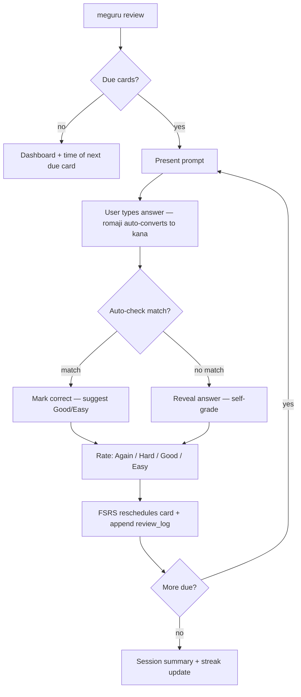

# Meguru — Product Requirements Document

> **Status:** Draft v0.1 · **Pitch:** "What if Japanese Duolingo and Claude Code had a baby."
> Companion docs: [TECH_STACK.md](TECH_STACK.md) · [BRD.md](BRD.md) · [CONSTITUTION.md](CONSTITUTION.md)

## Problem Statement

Developers who study Japanese live in the terminal, but their study tools don't. Anki is powerful yet a config-heavy desktop GUI with no Japanese opinion out of the box; Duolingo is gamified, shallow past the basics, and online-only; WaniKani is excellent for kanji but subscription-based, browser-bound, and covers one slice of the language. Meanwhile, AI tutoring is genuinely useful for Japanese (nuance, keigo, error diagnosis) but every AI tool assumes constant connectivity — which breaks the daily-habit loop the moment you're on a plane or a train.

**Meguru** is a terminal-native, offline-first Japanese SRS with a curated progression (kana → kanji → vocab → keigo → sentences), where AI is a strictly additive enhancement powered by the user's own API key or existing AI CLI subscription — never a dependency.

## Target Users

| Persona                                   | Description                                                      | Primary needs                                                      |
| ----------------------------------------- | ---------------------------------------------------------------- | ------------------------------------------------------------------ |
| **P1 — The author** (primary, dogfooding) | Solo dev, ~N5→N3, studies in short bursts between coding tasks   | One-command daily review; zero friction; works offline             |
| **P2 — Terminal-native learner**          | Developer studying Japanese; keyboard-only workflows             | No accounts, no browser, scriptable, respects their terminal setup |
| **P3 — Anki refugee**                     | Wants Japanese-specific structure without curating decks/plugins | Opinionated built-in decks; sane defaults; data import/export      |

## Core User Stories — Offline Mode (MVP unless tagged)

- **US-1:** As a new learner, I want guided hiragana/katakana lessons feeding into SRS, so that I build the foundation without hunting for decks.
- **US-2:** As a learner, I want `meguru review` to surface all due cards across decks, so that daily study is one command.
- **US-3:** As a learner, I want to type answers in romaji that auto-convert to kana, so that I don't need to configure a system IME.
- **US-4:** As a learner, I want FSRS scheduling with Again/Hard/Good/Easy ratings, so that my review load stays efficient and honest.
- **US-5:** As a learner, I want built-in kanji and vocab decks organized by JLPT level, so that content matches a recognized progression.
- **US-6 (post-MVP):** As an intermediate learner, I want keigo drills transforming plain forms into polite/honorific/humble equivalents, so that I practice what textbooks under-drill.
- **US-7:** As a learner, I want a dashboard with due counts, streak, and retention, so that progress stays visible and motivating.
- **US-8:** As a learner, I want sessions to be crash-safe and resumable, so that a closed laptop never loses progress.
- **US-9:** As the owner of my data, I want deck and progress import/export (JSON/CSV), so that my learning history is never captive.
- **US-10:** As an offline user, I want every core feature to work with zero network, so that commute and flight study always works.
- **US-11:** As a power user, I want non-interactive output (`meguru stats --json`), so that I can script and track my own metrics.

## Stretch User Stories — AI-Enhanced Mode (post-MVP, opt-in, user-supplied provider)

- **AI-1:** As a learner stuck on a leech card, I want freshly generated example sentences at my level, so that I see the word in new contexts instead of memorizing one card.
- **AI-2:** As a learner, I want an explanation of _why_ my answer was wrong (conjugation, politeness register, wrong reading), so that I fix the root cause, not the symptom.
- **AI-3:** As a learner, I want short conversational practice scenarios (e.g., ordering food) constrained to vocabulary I've learned, so that I apply cards in context.
- **AI-4:** As a learner, I want a personalized mnemonic for a kanji I keep failing, so that it finally sticks.
- **AI-5:** As a deck builder, I want batch-generated cloze sentences from my vocab (with preview before merge), so that my sentence deck grows from words I actually know.

Every AI story is governed by the data-flow inventory and consent rules in [CONSTITUTION.md §2 and SEC-4/5](CONSTITUTION.md). Accepted AI content is persisted locally and works offline thereafter.

## Feature Scope

| MVP (v0.1)                                  | Post-MVP Wave 1 (v0.2)               | Post-MVP Wave 2 (v0.3+)                           |
| ------------------------------------------- | ------------------------------------ | ------------------------------------------------- |
| Hiragana + katakana decks with guided intro | Keigo module (US-6)                  | AI provider abstraction + consent flow            |
| JLPT N5 kanji + N5 vocab built-in decks     | Sentence/cloze deck type             | AI-2 error explanations, then AI-1 examples       |
| FSRS engine + review/learn TUI flows        | N4–N3 content                        | AI-3 conversation, AI-4/5                         |
| Romaji→kana answer input                    | Review heatmap + retention analytics | FSRS parameter optimization from own `review_log` |
| Dashboard + basic stats                     | Anki `.apkg` import                  | Custom deck authoring TUI                         |
| Deck/progress import-export (JSON/CSV)      | Leech detection                      |                                                   |
| Config + cross-platform signed binaries     |                                      |                                                   |

### Review Session Flow

## Non-Functional Requirements

**Performance**

- Cold start to first frame < 100 ms; keypress-to-feedback < 50 ms.
- Due-card query < 10 ms at 100k cards; binary < 40 MB; steady-state RAM < 100 MB.

**Offline reliability**

- Zero network in core paths — enforced by a network-denied CI run ([CONSTITUTION SEC-8](CONSTITUTION.md)).
- SQLite WAL; session state written atomically per answer; graceful shutdown on SIGTERM/terminal close.
- AI failures/timeouts never block or corrupt a review session.

**Accessibility (terminal context)**

- Minimum 80×24; layout degrades gracefully on resize.
- Respects `NO_COLOR`; color is never the sole carrier of meaning (correct/incorrect also signaled by symbol + text).
- `--plain` mode: linear, screen-reader-friendly output, no cursor tricks.
- Romaji fallback everywhere for terminals without CJK fonts; configurable furigana display.

**Compatibility**

- Tested terminals: Terminal.app, iTerm2, Ghostty (macOS); GNOME Terminal, kitty, Alacritty (Linux); Windows Terminal. UTF-8 required and checked at startup with actionable guidance.
- Schema migrations are forward-only with automatic pre-migration backup; export is never lossy.

## Out of Scope (explicit)

- Audio: listening drills, TTS, pitch-accent audio (revisit after v1.0; pitch-accent _data field_ reserved in schema, no UI).
- Handwriting/stroke-order input or rendering.
- Mobile, web, or GUI companions; accounts, cloud sync, leaderboards, or any social features.
- Grammar textbook/course authoring — Meguru drills, it doesn't teach grammar from scratch (docs link out to standard resources).
- Languages other than Japanese (no speculative i18n of study content).
- Telemetry/analytics — **prohibited** by [CONSTITUTION SEC-12](CONSTITUTION.md), not merely deferred.
- Bundled API keys, hosted AI proxy, or any server-side component.
