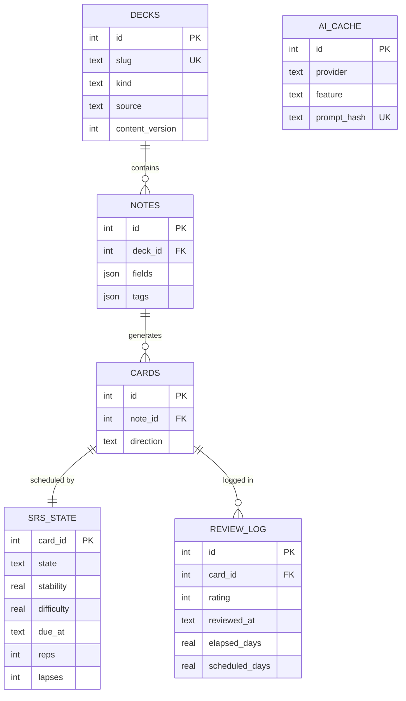
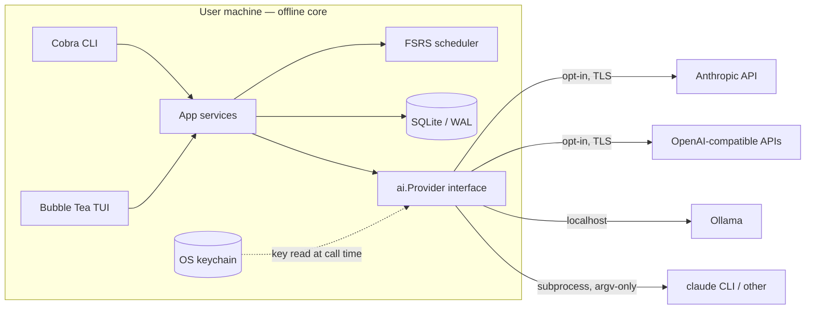

# Meguru — Tech Stack Specification

> **Status:** Draft v0.1 · **Owner:** Kiefer (solo dev) · **Scope:** Cross-platform (macOS / Linux / Windows Terminal) · **License:** Free OSS
> Companion docs: [PRD.md](PRD.md) · [BRD.md](BRD.md) · [CONSTITUTION.md](CONSTITUTION.md)

## 1. Language & Runtime

**Decision: Go** (current stable release; pinned in `go.mod`).

| Criterion | **Go** | Rust | TypeScript / Node | Python |
|---|---|---|---|---|
| TUI framework | Bubble Tea v2 (dominant Go TUI; 40k+ stars, v2 shipped Feb 2026) | Ratatui (mature, lower-level) | Ink (React-based) | Textual (richest widgets) |
| Single static binary | ✅ trivial | ✅ | ⚠️ SEA/pkg — large, finicky | ❌ PyInstaller per-OS pain |
| Cross-compile 6 targets from one machine | ✅ `GOOS`/`GOARCH` built in | ⚠️ possible, more setup | ⚠️ | ❌ |
| SQLite without native deps | ✅ `modernc.org/sqlite` (pure Go, no CGo) | ✅ rusqlite (bundled) | ⚠️ native builds | ✅ stdlib |
| CJK width handling in terminal | ✅ `go-runewidth`/`uniseg`, battle-tested | ✅ `unicode-width` | ⚠️ less proven | ✅ excellent |
| Solo-dev velocity (SDET background) | High — small language, fast compile loop | Lower — ownership curve | Highest familiarity | High familiarity |
| Cold start | <10 ms | <10 ms | ~100 ms+ | ~100 ms+ |

**Why Go wins for Meguru:** distribution is the decisive constraint. "Download one binary, run `meguru`" must work identically on all three platforms with zero runtime — only Go and Rust deliver that, and pure-Go SQLite keeps cross-compilation to all six OS/arch targets a one-line CI matrix (Rust + bundled SQLite needs per-target toolchains). Between the two, Go's iteration speed fits a nights-and-weekends solo dev better, and Bubble Tea's Elm architecture (pure `update(msg, model)` state transitions) makes the UI unit-testable — a deliberate portfolio signal for an SDET.

**Trade-offs accepted:** verbose error handling; fewer built-in widgets than Textual (mitigated by Bubbles); Bubble Tea v2 is only months old, so pin versions and verify ecosystem compatibility (e.g. `teatest`) before adopting v2-only features.

## 2. CLI/TUI Framework

- **TUI:** Bubble Tea v2 (`charm.land/bubbletea/v2`) + Bubbles (components) + Lip Gloss (styling).
- **CLI entry:** Cobra. Subcommands: `review`, `learn`, `stats`, `deck`, `ai`, `config`. TTY launches the TUI; non-TTY (or `--json`/`--plain`) emits scriptable output.
- **CJK correctness rule:** all display-width math goes through one internal `textwidth` package (wrapping `go-runewidth` + `uniseg`). No direct `len()` on user-visible strings — enforced by lint rule.

## 3. Local Storage & Data Model

- **Engine:** single SQLite file, WAL mode, via `modernc.org/sqlite`.
- **Locations** (via `adrg/xdg`): data → `$XDG_DATA_HOME/meguru/meguru.db` (macOS: `~/Library/Application Support/meguru/`, Windows: `%LOCALAPPDATA%\meguru\`); config → `config.toml` in the platform config dir. **Secrets never live in either** — see [CONSTITUTION SEC-1/SEC-2](CONSTITUTION.md).
- **Built-in decks:** embedded in the binary via `go:embed` as versioned JSON; synced into SQLite on first run and on `content_version` bumps.
- **Dictionary data:** curated subsets of JMdict / KANJIDIC2 (EDRDG, CC BY-SA 4.0 — attribution shipped in `LICENSES/` and an in-app credits screen). Kana and keigo content authored in-repo.

### Schema (SQLite)

```sql
CREATE TABLE decks (
  id              INTEGER PRIMARY KEY,
  slug            TEXT UNIQUE NOT NULL,      -- 'kana-hiragana', 'jlpt-n5-vocab'
  name            TEXT NOT NULL,
  kind            TEXT NOT NULL CHECK (kind IN ('kana','kanji','vocab','keigo','sentence')),
  source          TEXT NOT NULL CHECK (source IN ('builtin','user','ai')),
  content_version INTEGER NOT NULL DEFAULT 1,
  created_at      TEXT NOT NULL DEFAULT (datetime('now'))
);

CREATE TABLE notes (                          -- one fact; may yield several cards
  id         INTEGER PRIMARY KEY,
  deck_id    INTEGER NOT NULL REFERENCES decks(id) ON DELETE CASCADE,
  fields     TEXT NOT NULL,                   -- JSON: {"expression":"食べる","reading":"たべる","meaning":"to eat","examples":[...]}
  tags       TEXT NOT NULL DEFAULT '[]',      -- JSON array
  created_at TEXT NOT NULL DEFAULT (datetime('now')),
  updated_at TEXT NOT NULL DEFAULT (datetime('now'))
);

CREATE TABLE cards (                          -- note × study direction
  id        INTEGER PRIMARY KEY,
  note_id   INTEGER NOT NULL REFERENCES notes(id) ON DELETE CASCADE,
  direction TEXT NOT NULL CHECK (direction IN ('recognition','recall','production')),
  UNIQUE (note_id, direction)
);

CREATE TABLE srs_state (                      -- FSRS memory state per card
  card_id        INTEGER PRIMARY KEY REFERENCES cards(id) ON DELETE CASCADE,
  state          TEXT NOT NULL DEFAULT 'new' CHECK (state IN ('new','learning','review','relearning')),
  stability      REAL NOT NULL DEFAULT 0,
  difficulty     REAL NOT NULL DEFAULT 0,
  due_at         TEXT,
  last_review_at TEXT,
  reps           INTEGER NOT NULL DEFAULT 0,
  lapses         INTEGER NOT NULL DEFAULT 0
);
CREATE INDEX idx_srs_due ON srs_state(due_at);

CREATE TABLE review_log (                     -- append-only; enables FSRS re-optimization & stats
  id                INTEGER PRIMARY KEY,
  card_id           INTEGER NOT NULL REFERENCES cards(id) ON DELETE CASCADE,
  rating            INTEGER NOT NULL CHECK (rating BETWEEN 1 AND 4),  -- again/hard/good/easy
  reviewed_at       TEXT NOT NULL,
  state_before      TEXT NOT NULL,
  stability_before  REAL,
  difficulty_before REAL,
  elapsed_days      REAL,
  scheduled_days    REAL,
  duration_ms       INTEGER
);

CREATE TABLE ai_cache (                       -- local-only; purgeable (CONSTITUTION SEC-12)
  id          INTEGER PRIMARY KEY,
  provider    TEXT NOT NULL,
  model       TEXT NOT NULL,
  feature     TEXT NOT NULL,                  -- 'examples','explain','converse','mnemonic','augment'
  prompt_hash TEXT NOT NULL UNIQUE,
  response    TEXT NOT NULL,
  created_at  TEXT NOT NULL DEFAULT (datetime('now'))
);

CREATE TABLE app_state (                      -- non-secret runtime state: streaks, consent records, schema_version
  key   TEXT PRIMARY KEY,
  value TEXT NOT NULL                         -- JSON
);
```



## 4. Spaced-Repetition Algorithm: FSRS

**Decision: FSRS** (via `open-spaced-repetition/go-fsrs`, MIT), not SM-2.

- FSRS has been **Anki's default scheduler since 23.10** (Oct 2023) and produces **~20–30% fewer reviews at equal retention** than SM-2 — directly serving the "daily habit that doesn't burn out" goal.
- Maintained reference implementations and published test vectors exist in Go, removing the main historical argument for SM-2 (implementation simplicity).
- `review_log` stores everything FSRS's optimizer needs, so **personalized parameter tuning from the user's own history** is a post-MVP feature, not a schema migration.
- The scheduler sits behind one minimal interface — a pure function `(card state, rating, now) → (new state, due date)` — so it is property-testable, verifiable against upstream test vectors, and swappable in principle (no speculative multi-algorithm framework beyond that).

## 5. AI Provider Integration

One `ai.Provider` abstraction; the core app never imports a vendor SDK. Adapters are thin and config-selected (`config.toml → [ai] provider = "..."`).

| Adapter | Auth | Notes |
|---|---|---|
| `anthropic` | API key (OS keychain) | Direct Messages API |
| `openai-compatible` | API key (OS keychain) | Covers OpenAI + any compatible endpoint (Groq, Mistral, LM Studio…) |
| `ollama` | none | Local models; `http://localhost:11434` default |
| `cli` | user's existing subscription | Shells out to an allowlisted CLI (e.g. `claude -p`) — argv-only exec, prompt via stdin ([CONSTITUTION SEC-11](CONSTITUTION.md)) |

Provider contract (capabilities, not vendor calls):

| Method | Purpose | Payload constraint |
|---|---|---|
| `GenerateExamples` | fresh example sentences for a card | CONSTITUTION inventory AI-1 |
| `ExplainError` | why the user's answer was wrong | AI-2 |
| `Converse` | scenario-based conversation turn | AI-3 |
| `Mnemonic` | personalized memory hook | AI-4 |
| `AugmentDeck` | batch sentence/cloze generation | AI-5 |

**Design rules:** every call has a hard context timeout and is cancellable; failures degrade to offline behavior (features hide when unconfigured); responses are cached in `ai_cache`; accepted AI content is persisted into notes and thereafter **works fully offline** — AI enriches the deck, it never becomes a dependency.



## 6. Build, Packaging, Distribution

- **GoReleaser** on tag push (GitHub Actions): archives for `darwin|linux|windows × amd64|arm64`, Homebrew tap, Scoop bucket, `.deb`/`.rpm`/`.apk` via nfpm.
- **Integrity:** SHA-256 checksums, cosign keyless signing, SBOM, GitHub build-provenance attestation (supply-chain hygiene is a stated portfolio goal — [CONSTITUTION SEC-10](CONSTITUTION.md)).
- `go install github.com/<org>/meguru@latest` as the zero-infrastructure fallback.
- Single binary includes embedded decks; target < 40 MB.

## 7. Testing

| Layer | Tooling | Covers |
|---|---|---|
| Unit | stdlib `testing` + `testify/require` | pure `update()` state transitions, services |
| Property-based | `pgregory.net/rapid` | scheduler invariants: due dates never regress, stability/difficulty stay in bounds, arbitrary rating sequences never panic |
| Reference vectors | upstream FSRS test vectors | scheduler output parity with the canonical implementation |
| TUI snapshot | `teatest` golden files | rendered frames incl. CJK width edge cases |
| Integration | temp SQLite, real migrations | store layer, import/export round-trips |
| AI adapters | mock `Provider` + `go-vcr` fixtures | contract tests; **prompt-injection fixture suite** (malicious deck content — CONSTITUTION SEC-7) |
| E2E smoke | compiled binary under a PTY (`creack/pty`) | startup, one review, clean exit — per OS |
| CI gates | GitHub Actions 3-OS matrix | `-race`, `golangci-lint`, `govulncheck`, `gitleaks`, ≥80% coverage on core packages, **network-denied run proving the offline core makes zero egress** (CONSTITUTION SEC-8) |

## References

- FSRS in Anki (default since 23.10): [Anki FAQ](https://faqs.ankiweb.net/what-spaced-repetition-algorithm) · [fsrs4anki](https://github.com/open-spaced-repetition/fsrs4anki)
- Bubble Tea v2 (Feb 2026): [charmbracelet/bubbletea](https://github.com/charmbracelet/bubbletea) · [pkg.go.dev charm.land/bubbletea/v2](https://pkg.go.dev/charm.land/bubbletea/v2)
- Dictionary data licensing: EDRDG JMdict/KANJIDIC2, CC BY-SA 4.0
